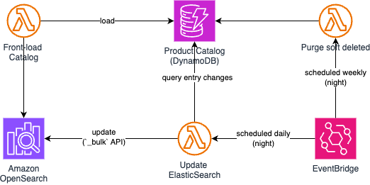
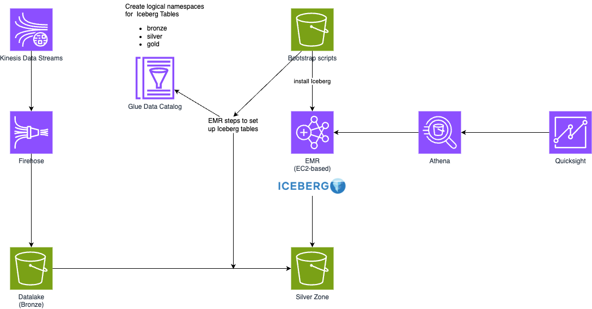

# cep_7_e-commerce
Advanced Scalable E-commerce Web Application with Real-Time Streaming, Security, Autoscaling, and Helm on AWS

## Required setup
Most of the infrastructure deployment is automated, however, there are 2 elements that need to be in place before running any of the GitHub Actions flows:
- static S3 bucket setup
- if using ECR: create repository
- create Pydantic Logfire account (free)

Additionally, all relevalt variables and secrets need to be added to GitHub for the CI/CD flows to work.

Once that is in place (and names replaced in relevant places), the app can be set up using the flows in order:
1. `infra-be.yaml` &rarr; creates the backend for TerraForm and ensures proper state-lock
2. `deply-dev.yaml` &rarr; creates all required AWS infrastructure and deploys the app using Helm

At this point the app can be access using the load balancer's endpoint (see in AWS UI). The app provides a functionality to automatically order 1 product per second and simulate failing orders. Logs can be seen in Pydantic Logfire, the link is provided inside the app.

To destroy all relevant infrastructure, trigger the third flow `infra-dev-destroy.yaml`.

> [!IMPORTANT]
> The LoadBalancer created by EKS will likely block the complete destruction. This needs to be deleted manually along with the VPC in the AWS UI.

The last step is to destroy the TerraForm Backend infrastructure with the 4th flow: `infra-be-destroy.yaml`.

---

# Notes on the Project
Below are my notes and considerations regarding the architecture and integrations of this project. Elements marked as "stretch" will not make it into the MVP.

## TerraForm setup
The TerraForm setup will include to basic principles:
1. state-lock for team collaboration
2. a tailored IAM role for TerraForm actions &rarr will limit potential actions that terraform can do and help with observability (stretch)

> [!IMPORTANT]
> A completely automated TerraForm setup for state-lock with separate CI/CD jobs isn't possible or needs some hard-coding (which is what I want to avoid as much as possible). To pass necessary state information between jobs, I will manually set up a static S3 bucket to accommodate data to pass between jobs.

## GitHub Actions (CI/CD)
The following flows are defined:
- `infra-be` (manual) &rarr; automatically creates components required for state-lock (IMPORTANT: needs a static bucket to write state and be-config to)
- `infra-be-destroy` (manual) &rarr; fetches the state of the backend and destroys the state-lock components
- `ci` (on push) &rarr; linting, formatting, testing of code
- `deploy-dev` (manual) &rarr; created all infrastructure for the web shop (IMPORTANT: depends on `infra-be` for the be-config file)
- `infra-dev-destroy` (manual) &rarr; destroys (almost) all webshop infrastructure and deploys the app on EKS using Helm

## Application (EKS)
The application will be hosted on EKS for scalability.

## ElasticSearch (ES)
ElasticSearch (ES) is a read-optimized cache for search.

Important characteristics:
- distributed (for horizontal scalability)
- does not pull data but needs to be fed (on change)
- stores both, the actual data to be queried, and the indices to optimize the query
- auto-infers indices &rarr needs careful configuration to avoid index explosion (!)

### Architectural considerations:
ES is resource hungry (need to ensure the processing nodes have enough CPU and RAM for the given data format) and duplicates data. I looked at a few comparable technologies to benchmark the case for ElasticSearch:

| Tool | Pros | Cons | Ideal When |
| :-- | :-- | :-- | :-- |
| Apache Lucene	| ✅ Same engine ES is built on ✅ Full control | ❌ Java-only ❌ No built-in distribution | 🟢 You're running Java apps 🟡 Want fine-grained local indexing |
| Typesense	| ✅ Simpler, developer-friendly ✅ Fast full-text search ✅ JSON API ✅ Light-weight | ❌ Less mature ❌ Limited scale | 🟢 Simpler product catalogs 🟡 1-node or lightweight distributed use |
| MeiliSearch | ✅ Super fast ✅ Easy to host ✅ Beautiful relevance out of the box | ❌ Still maturing ❌ Not built for huge data volumes | 🟢 Startup or mid-scale SaaS search 🟢 Local search-as-a-service |
| SQLite + FTS5 | ✅ Local, zero-infra ✅ Good for mobile / edge | ❌ No scale-out ❌ Minimal control	| 🟢 Mobile or single-user apps only |

ES especially shines with scale (~>10M entries). There are no safety issues per-se with duplicating the data (product catalogue).

> [!NOTE]
> ElasticSearch is appropriate to provide the full-text search functionality at scale for this application.

### Deployment considerations:
ES comes in many different flavors to deploy it for use. For the MVP of this project, we will start with the AWS version OpenSearch. This services removes most of the required overhead for starters.

Later, we will consider to migrate to ECK (Elastic Cloud on Kubernetes) for tighter GitOps integration, auto-scaling, or dynamic environment setup.

> [!IMPORTANT] 
> Running ES on EKS is operationally non-trivial: it involves StatefulSets, persistent volumes, readiness probes, node affinities, etc. It’s easy to break cluster consistency if misconfigured.

### ES Node updates &rarr; stretch:
ElasticSearch does not natively connect to its underlying data source but rather data needs to be fed into it by some external update mechanism. There are a few different options to do that:
1. CDC (Change Data Capture) &rarr real-time update of incremental changes over time
2. schedules sync / batch job
3. event-driven sync from application layer &rarr can hook directly into the API that creates/updates/deletes entries to do the same for ES

Since we are talking about a product catalogue, time for updates is not critical, i.e., no need for the complex real-time CDC pipeline setup. It is enough to have regular batch jobs (run at no-peak times) to update the ES nodes.

### Right-sizing (FinOps) &rarr; stretch:
For ES we need to consider factors that can influence both, CPU and EBS (elastic block storage) of each node.

## Storage & Analytics

### Data Ingestion (Kinesis)
Data ingestion will happen over a Kineses Streaming job, over to Kinesis Firehose and into an S3 bucket (Datalake and landing zone). This means that the application needs to register order events on Kinesis. Kinesis **will not write directly to Iceberg tables**. Instead, a SparkJob will periodically fetch raw data and ingest it into Iceberg.

> [!NOTE]
> Kinesis will likely produce duplicate records which needs to be taken care of properly to ensure orders don't get processed or counted multiple times.

The SparkJob will take care of deduplication.

### Data Layer
For the data layer, I will implement a "Bronze-Silver-Gold" system. For the table format, I chose **Apache Iceberg** on EMR (EC2-based) to have scalable and high-throughput data handling capabilities. After events are ingested into S3 (bronze), spark-jobs ran periodically will convert new data into silver and gold layer tables. This will take care of deduplication as well.

Prerequisites for this setup:
- AWS Glue catalog registers database names for bronze, silver, and gold
- S3 bucket with startup script for Iceberg and spark job scripts
- EMR steps configured for initial setup and recurring spark jobs

The bronze layer will run regular purging jobs to avoid accumulation of data over time (delete raw data older than 90 days).

### Analytics &rarr; stretch
As a base setup, I will use AWS Athena and Quicksight for quick and BI-level insights. Athena as a query engine integrates well with Iceberg. The b-s-g layers structure the data for relevant insights.

## Observability &rarr; stretch
Let's define what elements should be included for monitoring in this architecture:

| Component | :mag: Observability Needs |
| :-- | :-- |
| EKS (Flask app) | Pod health, app logs, request metrics, error rates, resource usage (CPU/mem) |
| Kinesis (Streams + Firehose) | Throughput metrics (records in/out, throttling, iterator age), delivery failures |
| EMR (Spark Jobs) | Job execution logs, step-level monitoring, cluster health, executor metrics |
| S3 (Iceberg tables) | Storage metrics, access patterns, failed reads/writes (CloudTrail, optionally object-level logs) |
| ElasticSearch | Cluster health, query latency, indexing rates, slow logs |
| Athena Queries | Query success/failure metrics, scan sizes, query durations |
| Glue Data Catalog | API usage logging, service errors (minor compared to others) |
| Overall Infrastructure | Resource consumption, cost observability (budget alerts optional), service quotas |

To collect and visualize loggs and metrics and issue alerts, I will work mostly with AWS CloudWatch, Grafana + Prometheus for a leightweight setup. I considered the ELK-stack as well, but decided against the operational overhead this would create, as well as the right-sizing considerations needed to control costs for ELK.

Considerations by component:

### EKS (Flask App)
- enable Fluent Bit as `DaemonSet` for log collection
- install Prometheus and Grafana

### Kinesis
- native integration with CloudWatch
- set CloudWatch Alarms on: (a) `IteratorAgeMilliseconds > threshold` (lagging consumers), and (b) `PutRecord` errors

### EMR (PySpark jobs)
- enable EMR debugging &rarr automatically pushes logs to S3 + CloudWatch
- install CloudWatch agent on EMR nodes

### ElasticSearch
- enable slow logs &rarr slow search queries + indexing events for optimization

### Athena/Glue
- CloudWatch metrics for Athena
- catalog API usage metrics
